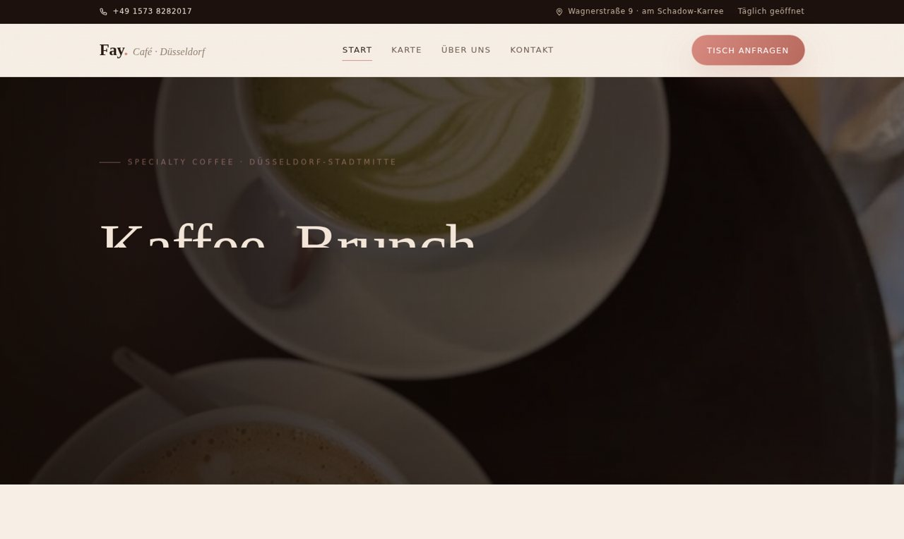

# Fay Café – Website

Mehrseitige, statische und stark animierte („cineastische") Website für das
**Fay Café** in Düsseldorf – Specialty Coffee, Matcha, hausgemachte Kuchen & Brunch,
Wagnerstraße 9 (direkt am Schadow-Karree).



## 👀 Live-Vorschau (direkt aus GitHub)

GitHub zeigt HTML nur als Quelltext – über **raw.githack** wird die Seite echt gerendert:

- **Vorschau-Übersicht:** [preview.html](https://raw.githack.com/Konrad01234/webseiten-verkaufen/claude/fake-kaffee-website-2vsxv1/sites/fay/preview.html)
- [Startseite](https://raw.githack.com/Konrad01234/webseiten-verkaufen/claude/fake-kaffee-website-2vsxv1/sites/fay/index.html) ·
  [Karte](https://raw.githack.com/Konrad01234/webseiten-verkaufen/claude/fake-kaffee-website-2vsxv1/sites/fay/speisekarte.html) ·
  [Über uns](https://raw.githack.com/Konrad01234/webseiten-verkaufen/claude/fake-kaffee-website-2vsxv1/sites/fay/ueber-uns.html) ·
  [Kontakt](https://raw.githack.com/Konrad01234/webseiten-verkaufen/claude/fake-kaffee-website-2vsxv1/sites/fay/kontakt.html)

> `preview.html` ist eine self-contained Showcase-Seite (Screenshots eingebettet) – ideal
> zum Herzeigen/Verschicken an das Café. Für den echten Livegang wird die Seite auf Vercel deployed.

## Seiten

| Datei | Inhalt |
|-------|--------|
| `index.html` | Startseite – animierter Hero, Marquee, Konzept, Highlights (verlinkt), Zahlen, Karten-Teaser, Galerie-Teaser, Reviews-Teaser, Öffnungszeiten + Karte, CTA |
| `kaffee.html` | Themenseite Kaffee & Espresso (Text, Karte, Mini-Galerie) |
| `matcha.html` | Themenseite Matcha & Specials |
| `brunch.html` | Themenseite Brunch & Herzhaft |
| `kuchen.html` | Themenseite Kuchen & Süßes (inkl. vegan) |
| `galerie.html` | Große Galerie mit allen Fotos |
| `bewertungen.html` | Echte Google-Rezensionen + Rating-Übersicht |
| `speisekarte.html` | Vollständige Karte: Kaffee, Matcha & Specials, Iced, Kuchen, Brunch |
| `ueber-uns.html` | Geschichte, Werte, Ambiente, Lage |
| `kontakt.html` | Kontaktdaten, Öffnungszeiten, Anfahrt, Anfrageformular (mailto) |
| `impressum.html` | Impressum (Platzhalter – Betreiberdaten ergänzen) |
| `datenschutz.html` | Datenschutzerklärung (an tatsächliche Dienste anpassen) |
| `styles.css` | Design-System |
| `app.js` | Preloader, Navigation, Reveals, Parallax, Count-ups, Formular, Cookie-Banner |
| `img/` | Platz für echte Fotos |

## Design

- **Stil:** warm, editorial, cineastisch – Espresso-Braun + Blush-Rosé + Creme, Matcha-Grün als Akzent.
- **Typografie:** Fraunces (Display), Cormorant Garamond (Kursiv-Akzente), Jost (Text) – via Google Fonts.
- **Claim:** „Kaffee, Brunch, Matcha, Kuchen und Liebe." (eigener Slogan des Cafés).
- **Animationen:** Preloader mit Tassen-Dampf, Hero mit Gradient-Pan + schwebenden Blobs + Latte-Steam,
  Text-Zeilen-Reveal, Laufband (Marquee), gestaffelte Scroll-Reveals, Parallax, mitschrumpfende Navbar,
  Scroll-Fortschritt, Count-up-Zähler, Karten-Tilt, Hover-Sheen, heute-hervorgehobene Öffnungszeiten,
  pulsierender Karten-Pin. Respektiert `prefers-reduced-motion`.
- **Bilder:** Echte Café-Fotos in `img/` (`fay-01.jpg` … `fay-18.jpg`), verwendet mit Genehmigung des
  Cafés. Aus Google-Maps-Screenshots freigestellt (UI-Ränder entfernt) und web-optimiert (JPG).
  Hero = `fay-02`, Signatur-Panel = `fay-08`, Galerie = 01/06/07/11/13/15/17/18, Über-uns-Panels
  = `fay-17`/`fay-09`, Subhero-Bilder = 06/01/16.

## Verifizierte Daten (Quelle: öffentliche Web-/Google-Maps-Angaben)

- **Name:** Fay Café
- **Adresse:** Wagnerstraße 9, 40212 Düsseldorf (am Schadow-Karree / Kö-Bogen)
- **Telefon:** +49 1573 8282017
- **Instagram:** @faycafetime · **Web:** faycafe.de
- **Öffnungszeiten:** Mo 08:00–16:30 · Di–Fr 08:00–20:00 · Sa 08:00–16:30 · So 08:30–15:00
- **Angebot & Preise (Preistafel im Café):** Doppio 3,8 · Americano 3,8 · Macchiato 4,8 ·
  Cappuccino 4,8 · Cortado 5,0 · Flat White 5,5 · Chai Latte 5,8; Matcha Latte, Saffron/Strawberry/
  Mango Matcha; Iced Latte/Americano/Chai; hausgemachte & vegane Kuchen (Carrot Cake, Chai-Cheesecake,
  Oreo/Blueberry), Brunch (Avocado-Brot, Pancakes …).
- **Rezensionen:** echte Google-Bewertungen (Akseniya Arif ★★★★★, Hell Anne ★★★★★,
  Mensch Meyer ★★★★).

> **Vor Livegang bitte final abgleichen:** vollständige Preisliste (Matcha-Specials & Iced-Preise
> waren auf dem Foto teils angeschnitten – Schätzwerte im Tiertakt der Tafel), exakte Öffnungszeiten
> sowie Impressums- und Datenschutzangaben.

## SEO & Technik

- `favicon.svg` – Fay-Monogramm (Kaffeetasse), theme-color gesetzt.
- Open-Graph- & Twitter-Cards (Vorschaubild = `img/fay-02.jpg`) für schöne Link-Vorschauen.
- JSON-LD `CafeOrCoffeeShop` auf der Startseite (Adresse, Telefon, Öffnungszeiten,
  Instagram, Google-Maps-Link) für Rich Results.
- `sitemap.xml` + `robots.txt` (Impressum/Datenschutz auf `noindex`).
- `vercel.json`: `cleanUrls`, langes Caching für `/img`, Basis-Security-Header.

## Lokal testen

```bash
cd sites/fay
python3 -m http.server 8000
# http://localhost:8000
```

## Vercel

Eigenes Projekt mit **Root Directory** `sites/fay`, Framework-Preset `Other` (statisch, kein Build).
